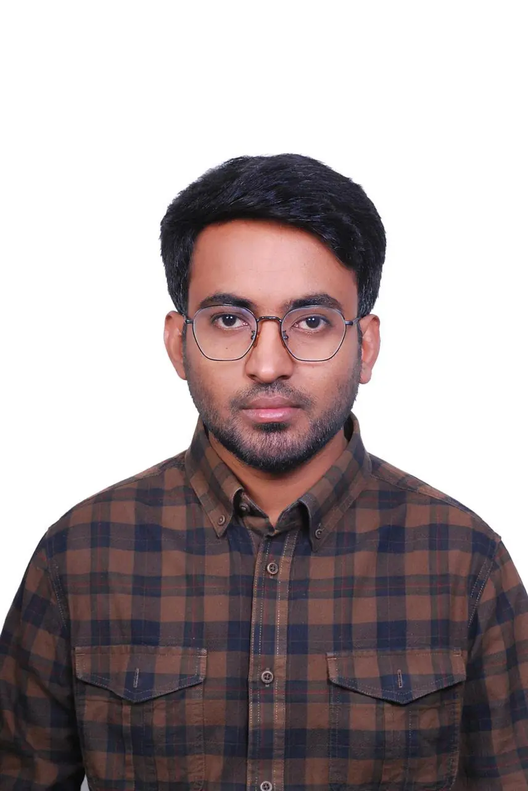

<!--
  Saidul Islam — Split Identity GitHub Profile
  Real GitHub-supported Markdown + HTML
  No full-page UI image, no animation, no custom CSS
-->

<table width="100%">
  <tr>
    <td width="34%" align="center" valign="top">
       
      
      <h2>Saidul Islam</h2>
      
<strong>MERN Stack · Full-Stack Developer</strong>

      
📍 Khulna, Bangladesh

      

      

        🔗 <a href="https://www.linkedin.com/in/saidulislam007">LinkedIn</a> 
        ✉️ <a href="mailto:said38383742@gmail.com">said38383742@gmail.com</a> 
        📞 <a href="tel:+8801911625953">Phone — 01911625953</a> 
        💬 <a href="https://wa.me/8801911625953">WhatsApp — 01911625953</a>
      

    </td>
    <td width="66%" valign="top">
       
      <h1>Hi 👋, I’m <code>Saidul Islam</code></h1>
      <h3>MERN Stack / Full-Stack Developer</h3>
      

        I build fast, scalable and user-friendly web applications with clean
        interfaces, secure APIs, maintainable architecture and
        production-focused engineering.
      

      
🟢 <strong>Available for full-time opportunities</strong>

       
      <table width="100%">
        <tr>
          <td align="center">
            <strong>MERN</strong> 
            Developer
          </td>
          <td align="center">
            <strong>Full-Stack</strong> 
            Frontend + Backend
          </td>
          <td align="center">
            <strong>Responsive</strong> 
            Mobile to Desktop
          </td>
          <td align="center">
            <strong>Open</strong> 
            To Work
          </td>
        </tr>
      </table>
       
      

        <a href="https://saidul-portfolio-pi.vercel.app"><strong>View Portfolio</strong></a>
        &nbsp;·&nbsp;
        <a href="https://docs.google.com/document/d/1bflPiymWGmhlgkTOAmgIMrsV6NKkZ6bbWRN3tFtVYRA/export?format=pdf"><strong>Download Resume</strong></a>
        &nbsp;·&nbsp;
        <a href="mailto:said38383742@gmail.com"><strong>Contact Me</strong></a>
      

    </td>
  </tr>
</table>

## 👤 About Me

I’m a MERN Stack developer from **Khulna, Bangladesh** who enjoys turning practical ideas into dependable web applications. I work across the full development cycle—from responsive interfaces and reusable components to REST API design, authentication, database modeling and production deployment.

- 🔭 Building production-minded applications with **Next.js and MERN**
- 🔐 Interested in **backend architecture, JWT and web security**
- 🧩 Comfortable with **role-based dashboards and end-to-end workflows**
- 📱 Focused on **responsive, accessible and maintainable interfaces**
- 💼 Looking for a team where I can contribute, take ownership and grow

---

## </> Technical Expertise

### Frontend

  <code>React</code>&nbsp;
  <code>Next.js</code>&nbsp;
  <code>JavaScript ES6+</code>&nbsp;
  <code>HTML5</code>&nbsp;
  <code>CSS3</code>&nbsp;
  <code>Tailwind CSS</code>&nbsp;
  <code>Framer Motion</code>

### Backend, Security & Data

  <code>Node.js</code>&nbsp;
  <code>Express.js</code>&nbsp;
  <code>REST API</code>&nbsp;
  <code>JWT / Web Security</code>&nbsp;
  <code>MongoDB</code>&nbsp;
  <code>Firebase</code>

### Tools & Deployment

  <code>Git</code>&nbsp;
  <code>GitHub</code>&nbsp;
  <code>Vercel</code>&nbsp;
  <code>VS Code</code>&nbsp;
  <code>Lucide React</code>

---

## 🎓 Education & Learning Journey

<table width="100%">
  <tr>
    <td width="55%" valign="top">
      <h3>Academic Background</h3>
      <ul>
        <li><strong>B.Sc. (Honours) in Mathematics</strong></li>
        <li><strong>Higher Secondary Certificate (HSC)</strong></li>
        <li><strong>Secondary School Certificate (SSC)</strong></li>
      </ul>
      

        My mathematics background helps me break complex problems into
        structured logic, clear models and maintainable solutions.
      

    </td>
    <td width="45%" valign="top">
      <h3>Currently Learning</h3>
      <ul>
        <li>Advanced Next.js & App Router</li>
        <li>System Design & Architecture</li>
        <li>Docker & Kubernetes</li>
        <li>CI/CD & DevOps Practices</li>
      </ul>
    </td>
  </tr>
</table>

---

## 📊 Developer Snapshot

<table width="100%">
  <tr>
    <td width="50%" valign="top">
      <h3>What I Build</h3>
      <ul>
        <li>Responsive product interfaces</li>
        <li>Secure REST APIs</li>
        <li>Authentication and authorization</li>
        <li>Role-based dashboards</li>
        <li>Production deployments</li>
      </ul>
    </td>
    <td width="50%" valign="top">
      <h3>What I Value</h3>
      <ul>
        <li>Clean, maintainable code</li>
        <li>Performance and accessibility</li>
        <li>User-focused problem solving</li>
        <li>Continuous learning</li>
        <li>Teamwork and communication</li>
      </ul>
    </td>
  </tr>
</table>

---

## ✉️ Let’s Connect

  I’m open to full-time opportunities, internships and meaningful
  collaborations.

  <a href="mailto:said38383742@gmail.com"><strong>Email Me</strong></a>
  &nbsp;·&nbsp;
  <a href="tel:+8801911625953"><strong>Call Me</strong></a>
  &nbsp;·&nbsp;
  <a href="https://wa.me/8801911625953"><strong>WhatsApp</strong></a>
  &nbsp;·&nbsp;
  <a href="https://www.linkedin.com/in/saidulislam007"><strong>LinkedIn</strong></a>
  &nbsp;·&nbsp;
  <a href="https://saidul-portfolio-pi.vercel.app"><strong>Portfolio</strong></a>
  &nbsp;·&nbsp;
  <a href="https://docs.google.com/document/d/1bflPiymWGmhlgkTOAmgIMrsV6NKkZ6bbWRN3tFtVYRA/export?format=pdf"><strong>Resume</strong></a>

