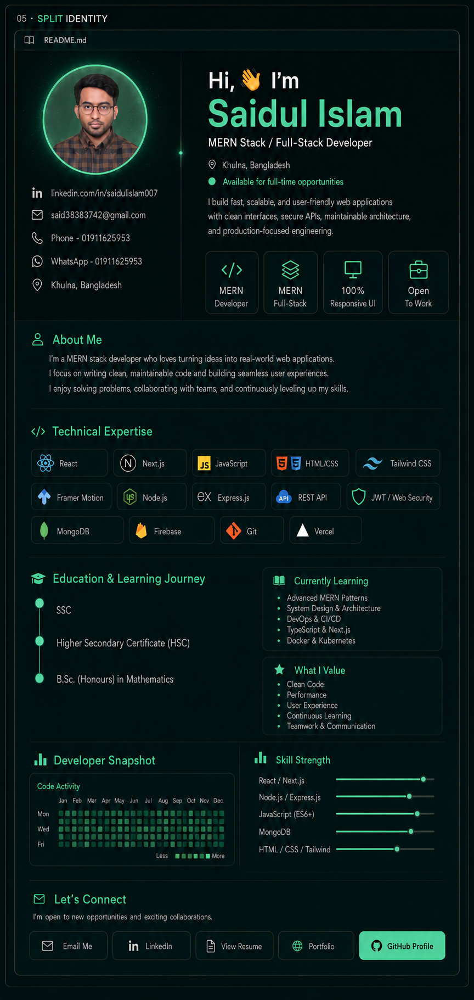

<!--
  Saidul Islam — Split Identity GitHub Profile
  Static UI: no animation
  Upload this README.md and the assets folder to:
  https://github.com/Saidulislam007/Saidulislam007
-->

  

  <a href="mailto:said38383742@gmail.com"><b>Email Me</b></a>
  &nbsp; • &nbsp;
  <a href="tel:+8801911625953"><b>Phone</b></a>
  &nbsp; • &nbsp;
  <a href="https://wa.me/8801911625953"><b>WhatsApp</b></a>
  &nbsp; • &nbsp;
  <a href="https://www.linkedin.com/in/saidulislam007"><b>LinkedIn</b></a>
  &nbsp; • &nbsp;
  <a href="https://docs.google.com/document/d/1bflPiymWGmhlgkTOAmgIMrsV6NKkZ6bbWRN3tFtVYRA/export?format=pdf"><b>View Resume</b></a>
  &nbsp; • &nbsp;
  <a href="https://saidul-portfolio-pi.vercel.app"><b>Portfolio</b></a>
  &nbsp; • &nbsp;
  <a href="https://github.com/Saidulislam007"><b>GitHub Profile</b></a>

