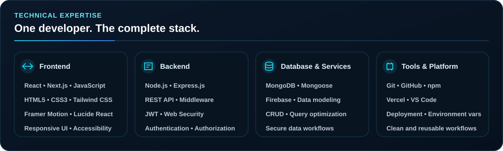

  

   
   

  

  
  

 

 

 

 

## GitHub activity

  
  

 

  

 

  <h3>Let&apos;s build something useful, reliable and impossible to ignore.</h3>
  
Open to full-time roles, internships and meaningful collaborations.

  
  

<!--
  Bento Engineer GitHub Profile README
  Custom CSS animations are embedded inside the SVG files in /assets.
  Replace or add your portfolio, LinkedIn and email links in the connect section when ready.
-->
=======

  

  <a href="mailto:said38383742@gmail.com">Email</a> •
  <a href="tel:+8801911625953">Phone</a> •
  <a href="https://wa.me/8801911625953">WhatsApp</a> •
  <a href="https://www.linkedin.com/in/saidulislam007">LinkedIn</a> •
  <a href="https://saidul-portfolio-pi.vercel.app">Portfolio</a>

>>>>>>> 754af6e3179eb5f156a613ddb4747ae07a0a08a6
