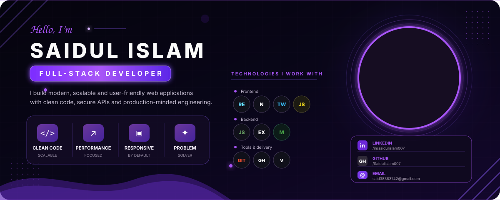
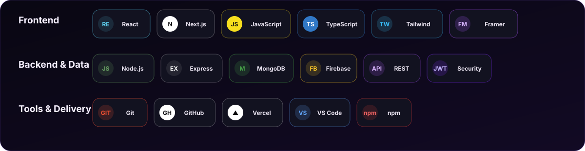

  

<h1 align="center">Hi 👋, I'm Saidul Islam</h1>
<h3 align="center">Full-Stack Developer · MERN & Next.js</h3>

  I build modern full-stack products with clean interfaces, secure APIs, scalable architecture, and production-focused engineering.

  <a href="https://saidul-portfolio-pi.vercel.app"><strong>Portfolio</strong></a>
  &nbsp;•&nbsp;
  <a href="https://www.linkedin.com/in/saidulislam007"><strong>LinkedIn</strong></a>
  &nbsp;•&nbsp;
  <a href="mailto:said38383742@gmail.com"><strong>Email</strong></a>
  &nbsp;•&nbsp;
  <a href="https://wa.me/8801911625953"><strong>WhatsApp</strong></a>

👨‍💻 About Me

I’m a MERN Stack Developer from Khulna, Bangladesh, focused on building responsive and user-friendly applications that solve practical problems. I enjoy connecting thoughtful frontend experiences with secure backend systems, authentication, REST APIs, data modeling, and reliable deployment.

🔭 Building production-minded applications with Next.js and the MERN stack

🧠 Interested in backend architecture, authentication, web security, and system design

🎓 B.Sc. (Honours) in Mathematics — National University, Bangladesh

💼 Available for full-time opportunities, internships, and collaborations

🛠 Technologies I Work With

  

🚀 Featured Projects

<table>
<tr>
<td width="50%" valign="top">

RouteSync

Smart fleet coordination

A company vehicle-sharing platform that intelligently groups nearby employee trips and gives transport teams a real-time operational workflow.

<code>Next.js</code> <code>Express.js</code> <code>MongoDB</code> <code>Better Auth</code>

Repository →

</td>
<td width="50%" valign="top">

FurniLux

Full-stack furniture commerce

A premium marketplace with secure authentication, role-aware dashboards, product governance, ordering, and delivery workflows.

<code>Next.js</code> <code>TypeScript</code> <code>Node.js</code> <code>MongoDB</code>

Client → · Server →

</td>
</tr>
<tr>
<td width="50%" valign="top">

BiblioDrop

Book marketplace & library system

A digital library ecosystem for discovery, wishlists, delivery, reviews, and role-aware content administration.

<code>Next.js</code> <code>Express.js</code> <code>JWT</code> <code>MongoDB</code>

Client → · Server → · Live →

</td>
<td width="50%" valign="top">

KeenKeeper

Friendship analytics

A human-centered application for understanding friendships through interaction tracking, timelines, and accessible visual insights.

<code>React</code> <code>Tailwind CSS</code> <code>Context API</code> <code>Recharts</code>

Repository →

</td>
</tr>
</table>

  <a href="https://saidul-portfolio-pi.vercel.app/#work"><strong>Explore detailed case studies on my portfolio →</strong></a>

🧩 What I Bring

<table>
<tr>
<td align="center" width="25%"><strong>Clean Code</strong> Readable & scalable</td>
<td align="center" width="25%"><strong>Performance</strong> Fast product experiences</td>
<td align="center" width="25%"><strong>Responsive UI</strong> 320px to widescreen</td>
<td align="center" width="25%"><strong>Problem Solving</strong> Logic-driven decisions</td>
</tr>
</table>

📐 Analytical Foundation

My academic journey in pure mathematics strengthened my analytical thinking. It trained me to decompose complex real-world problems into structured logic, algorithmic models, and maintainable system architectures—the same mindset I apply to software engineering.

<h2 align="center">Let’s Build Something Meaningful</h2>

  Have a role, a product, or a hard problem? I’m ready to contribute, take ownership, and grow with an experienced engineering team.

  <a href="mailto:said38383742@gmail.com"><strong>Start a conversation →</strong></a>
  &nbsp;•&nbsp;
  <a href="https://saidul-portfolio-pi.vercel.app"><strong>View portfolio →</strong></a>

